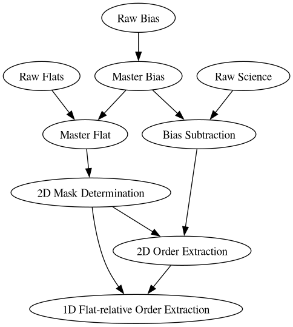

# MARVEL pipeline
Data processing and radial velocity estimation pipeline of the MARVEL spectrograph


## Running the different components of the pipeline

The pipeline is made out of different components that can run one after the other. Every time a component finishes it will create a FITS file with the intermediate results saved into it. This file can then serve as input for another component. An example of how these components rely on the results of previous components is illustrated in the following graph:




## Dependencies

### Rust and DVC

The pipeline components are written in [Python](https://www.python.org/) or [rust](https://foundation.rust-lang.org/). 
To manage the pipeline we use a command line tool called [DVC](https://dvc.org/). 
In the following section, we explain how to install the Python packages using poetry. 
To [install rust](https://www.rust-lang.org/tools/install) and [DVC](https://dvc.org/#get-started-dvc) we recommend 
following the official installation guide given on their respective websites. 

### Python dependencies

Before starting to install the packages, we recommend using a software tool to manage different environments like [conda](https://docs.conda.io/projects/conda/en/stable/commands/create.html) to create an environment for marvel. Using conda, use the command:

```
conda create -n marvelpipeline [python=<python version>]
```

where the `<python-version>` should be higher than Python 3.9. We can then activate the environment with

```
conda activate marvelpipeline
```

To install the needed Python packages we recommend installing the package dependency manager [poetry](https://python-poetry.org/) using [the official installation](https://python-poetry.org/docs/). This tool allows us to install all the packages with one command in a reproducible way. We can install the dependencies with the command:

```
poetry install
```

This command will look for the `pyproject.toml` file in the directory, and install all the dependencies that are specified in that file.


## Compiling the pipeline

As the computationally heavy parts of the pipeline are written in Rust, you need to build the rust code before it can be run. This process a made easy by simply running the following bash shell script (to be executed in the home folder of the Marvel pipeline repository):

```
./compile
```


## Configuration files

#### The `inputfile.yaml` file

In `inputfile.yaml` you can specify which CCD image FITS files (raw bias images, raw flat images, and raw science images) should be processed. 


#### The `params.yaml` file

`params.yaml` is the inputfile that the DVC pipeline will use to process the MARVEL images. It contains both the input FITS files as
well as the output directory names and the output file names. `params.yaml` should be auto-generated from `inputfile.yaml` using the
`configure.py` script:

```
python configure.py inputfile.yaml <root folder to raw data> <root folder to processed data>
```

For example:
```
python configure.py inputfile.yaml /home/marvel/rawdata/  /home/marvel/processeddata/

```

All folder locations of raw MARVEL data files mentioned in the params.yaml file are relative to the specified root folder of raw data.
Similarly, all folder locations of a pipeline product mentioned in the params.yaml file are relative to the specified root folder of
processed data.


#### The `dvc.yaml` file

In the file `dvc.yaml` the you can specify what parts of the pipeline should be run. As a user you most likely do not want to touch this 
file, unless you want to experiment with different algorithms.


## Running the pipeline

The pipeline can be run on the command line using DVC:

```
dvc repro
```

DVC will search for the `params.yaml` inputfile and use it to process the MARVEL CCD images, specified in it. 
Note that dvc is intelligent enough to detect whether a pipeline step needs to be rerun or not. For example, if the bias and flat field 
frames did not change from a previous run, and only the input science frames changed, it will not rerun the computation of the master bias 
or the master flat field images if it can still find them in their output directories. If you want to enforce a complete rerun of the entire pipeline, you can use

```
dvc repro -f
```


## The pipeline output

The results of the pipeline are stored in the `Data/ProcessedData/` directory. It contains the following subdirectories:

- `MasterBias/`: contains the master bias FITS file: a median of several raw bias images.
- `MasterFlat/`: contains the master flat FITS file: a median of several raw flat images, bias subtracted.
- `BiasSubtractedScience/`: contains 2D science image FITS files, of which the master bias was subtracted.
- `ExtractedOrders/`:  this contains 2 subdirectories
	- `Mask/`:
		- `*_2d_mask.fits`: contains for each row of the CCD image the column where the order begins, the column where the order ends, and the column where the order has the maximum flux. This file is used to extract the 1d orders of each science frame.
		- `*_smoothed_master_flat.fits`: a smoothed version of the master flatfield image. This is the image that is used to determine the position of the orders.
	- `Science/`: for each bias subtracted science frame, the `*_2d_orders.fits` file contains a CCD image where all pixels outside the orders are set to zero. This file is only used for debugging and visualization purposes, and is not further used by the pipeline.
- `OptimalExtraction/`: for each bias subtracted science frame, the `*_1d_orders.fits` file contains the 1D flat-relative extracted orders. These 1D orders are the ratio of the stellar spectrum divided by the flatfield lamp spectrum. As both the stellar spectrum and the flatfield spectrum experience the same blaze function, the ratio should be free of the blaze function. For each order a flat-normalized flux as a function of pixel coordinate is stored. The orders are not merged.
- `WaveCalibration/`: TBD
 
	


